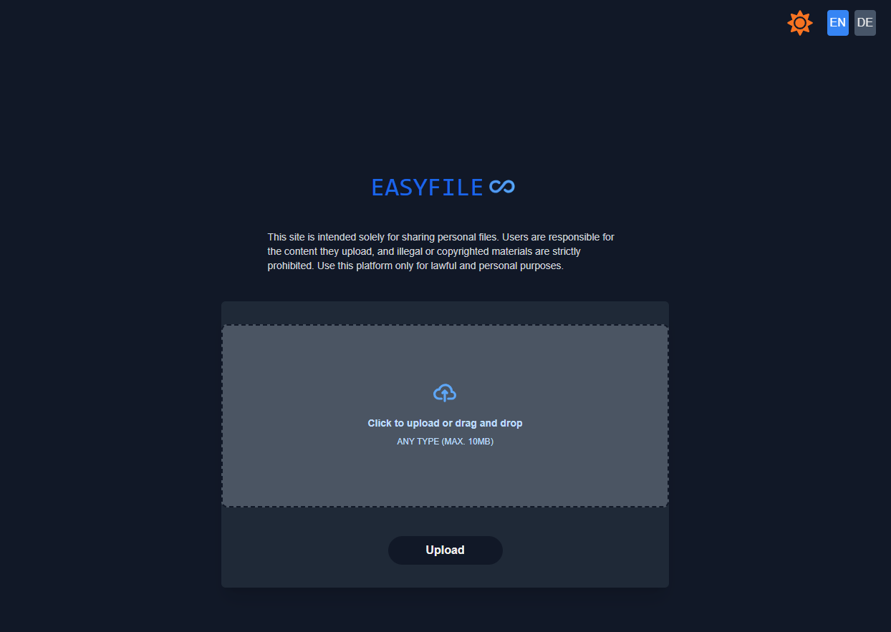
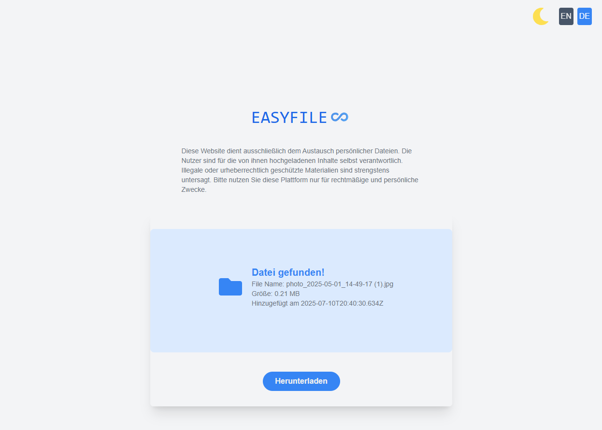

# 📂 EasyFile - File Sharing Service




EasyFile is a **file-sharing web application** built with **Next.js (React)** that allows users to **upload files and share a download link** with friends. Similar to web-based file-sharing services, it simplifies file transfers.

## 🚀 Features
- Upload a file and receive a shareable link
- Secure file storage using **PostgreSQL**
- Backend API for handling file uploads/downloads
- Dockerized environment for easy deployment

## 🛠️ Tech Stack
- **Frontend:** Next.js (React)
- **Backend:** Next.js API Routes
- **Database:** PostgreSQL (via Prisma ORM)
- **Storage:** Local
- **Deployment:** Docker, Docker Compose

---

## 🏗️ Installation & Setup

### 1️⃣ **Clone the Repository**
```sh
git clone https://github.com/alex-bodn/easyfile.git
cd easyfile
```

### 2️⃣ **Install Dependencies**

```
npm install
```

### 3️⃣ **Make DB migration and run docker**

```
npx prisma migrate dev --name init
docker-compose up -d
```


### 🏃‍♂️ **Running the Project Locally**

```
npm run dev
```
